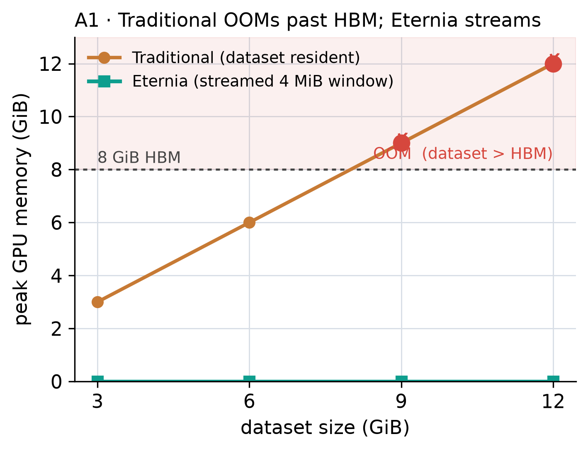
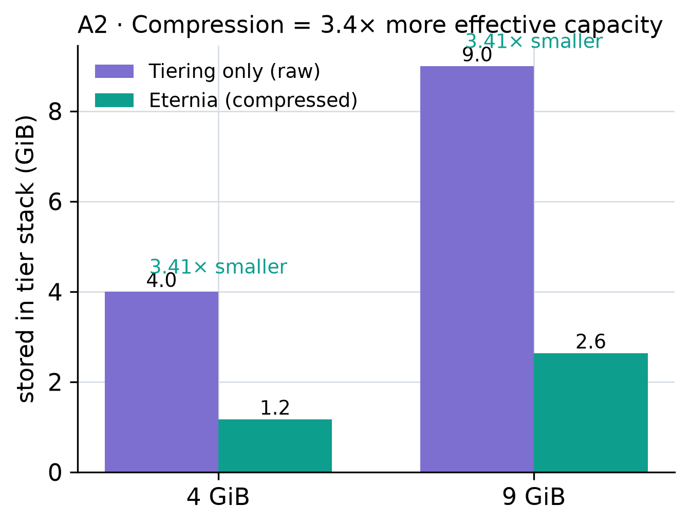
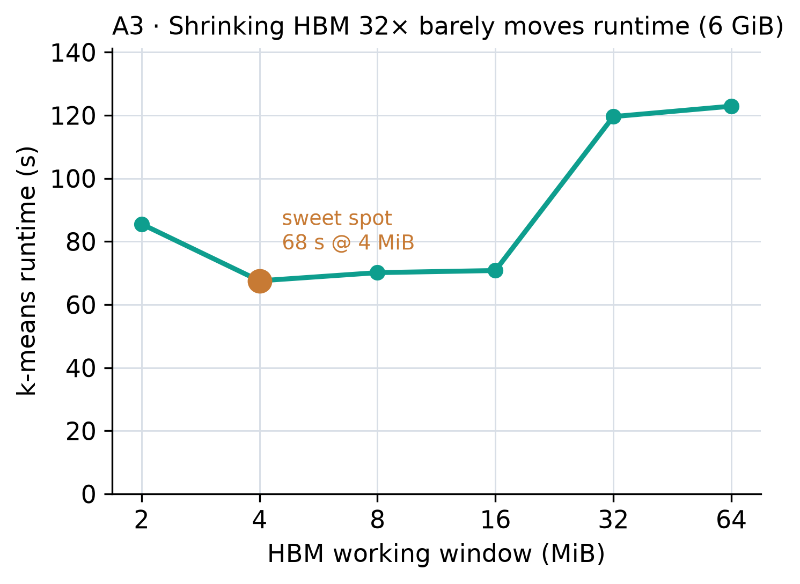
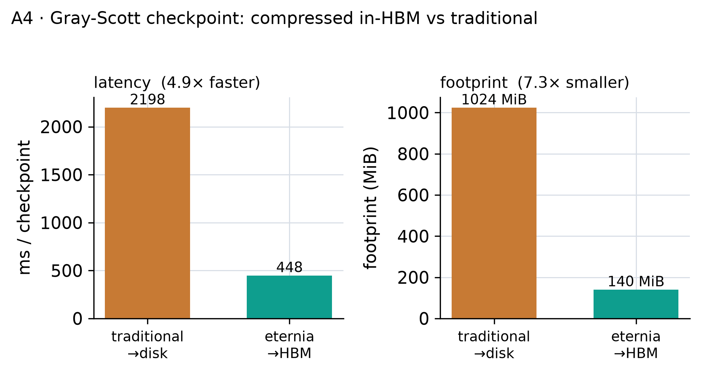

# Eternia — Benchmark Setup & Results

A self-contained report of the single-GPU evaluation of **Eternia**, the tier-aware **compressed**
GPU vector, modeled on the MegaMmap (Logan 2024) evaluation. It explains *what each benchmark
measures and how it is set up*, then gives the results. Machine-readable data is in
`eternia_results/*.csv`; figures in `eternia_results/figures/`; the multi-GPU (Delta) plan is in
`eternia_megammap_eval_plan.md`.

---

## 1. System under test and the question

**Eternia** presents a GPU array (`gv::Vector`) whose pages live across a storage-tier stack
(HBM → DRAM → NVMe → PFS) and are **error-bounded compressed** (cuSZp). Computation runs by
*streaming*: a `SequentialTransaction` pulls a small, fixed-size **window** of pages into real GPU
HBM, decompresses it, the kernel consumes it, it is evicted, and the next window is prefetched
(window W+1 decompresses while W is consumed). It is the GPU sibling of MegaMmap's `mm::Vector` +
`SeqTxBegin`, plus an axis MegaMmap does not have: **compression**.

**The question this evaluation answers:** *can Eternia run GPU workloads whose data is larger than
GPU memory, and what does compression buy on top of tiering?* The wall here is **GPU HBM** (the
MegaMmap analog is node DRAM).

---

## 2. Methods compared

| Method | How the dataset is held | Peak GPU memory | Analog |
|---|---|---|---|
| **Traditional (in-core)** | whole dataset `cudaMalloc`'d resident in HBM | = dataset size | in-memory Spark/MPI, FAISS-GPU |
| **Tiering-only** | dataset stored **raw** across the tier stack, streamed | = one window | MegaMmap (no compression) |
| **Eternia** | dataset stored **compressed** across the tier stack, streamed | = one window | this work |

The traditional method is a fair proxy for any in-core GPU clustering library: it must have every
vector resident to compute distances, so its peak GPU memory equals the dataset and it OOMs once the
data exceeds HBM. Tiering-only and Eternia differ *only* in whether pages are compressed — isolating
compression's effect. In the harness, the ablation is done by **routing**: Eternia writes through the
compressor pool (`600` → compress → cte_core `512`); tiering-only writes straight to cte_core `512`
(raw). (`ctx.dynamic_compress_=0` alone does **not** disable compression — the cuSZp pin on pool 600
always compresses, so the pool choice is what ablates.)

---

## 3. Testbed

- **GPU:** NVIDIA RTX 5060 Laptop, **8 GiB HBM**, compute capability sm_120 (~6.9 GiB free at runtime
  after the CLIO runtime loads).
- **Host:** 15 GiB RAM (≈13 GiB free), used for the DRAM storage tier and the tiled SIFT set.
- **Software:** CUDA 12.6 (nvcc; sm_120 reached via `compute_90` PTX-JIT), **cuSZp v3.0.0** (built
  from source, arch 90), CLIO runtime with the compressor + cte_core + bdev chimods. Runs inside a
  Docker container with `--gpus all`.
- **Compression:** cuSZp, absolute error bound **1e-3**, BALANCED preset. (cuSZp ran correctly on
  sm_120 here — no PTX-JIT clobbering observed, despite the documented caution.)
- **Storage tiers (this box):** an emulated "hbm" bdev tier + a DRAM (`ram`) bdev tier. Because the
  hbm tier is host-backed and the `max_bw` placement policy prefers `ram`, all compressed data landed
  in the DRAM tier (the HBM/DRAM *split* is therefore not exercised here — see §8).

**Dataset — SIFT1M.** 1,000,000 real 128-dimensional SIFT image descriptors (the canonical k-means /
ANN benchmark, TEXMEX corpus, `sift_base.fvecs`). Values are normalized to [0,1] (÷255) so the 1e-3
absolute error bound is meaningful against the native 0–255 range. To build datasets larger than the
1M real vectors, the set is **tiled** (held once in host memory, ~512 MiB, indexed modulo the file) —
so an N-GiB logical dataset is assembled from real vectors without a larger download.

---

## 4. Workloads

- **k-means** (read-intensive, streaming): 256 clusters, `k`-means‖-style; each iteration sweeps the
  entire dataset once as a `SequentialTransaction` (window W+1 decompresses while W is clustered),
  assigning every point to its nearest centroid. This is exactly the repeated full-dataset read that
  the streaming/prefetch path targets. Used in benchmarks A1–A3.
- **Gray-Scott** (write-intensive, checkpointing): the canonical reaction-diffusion loop; every
  `interval` steps the field is checkpointed. Used in A4.

---

## 5. Benchmarks — setup and results

15 benchmark runs produced the four figures (A1: 4, A2: 4, A3: 6, A4: 1), plus 2 correctness runs.

### A1 — Capacity crossover *(MegaMmap Fig 6 analog)*

**Setup.** Fix everything except dataset size. For each size ∈ {3, 6, 9, 12} GiB (1 MiB pages), the
harness runs **both** methods in one process: (1) Traditional — attempt to hold the whole dataset in
HBM and cluster it; (2) Eternia — store it compressed across the tiers and cluster it by streaming a
4 MiB window. The traditional allocation is gated on a live free-memory query (a doomed multi-GB
`cudaMalloc` *hangs* on the 12.x driver rather than returning an error), so OOM is reported cleanly.
4 runs.



| dataset | Traditional | Eternia | Eternia peak GPU |
|--------:|:-----------:|:-------:|:----------------:|
| 3 GiB  | OK, 9.5 s | OK — 900 MiB stored (3.41×), km 33 s | 4 MiB |
| 6 GiB  | OK, 18 s  | OK — 1800 MiB (3.41×), km 66 s | 4 MiB |
| 9 GiB  | **OOM** | OK — 2701 MiB (3.41×), km 100 s | 4 MiB |
| 12 GiB | **OOM** | OK — 3601 MiB (3.41×), km 131 s | 4 MiB |

**Result.** Traditional peak GPU = the dataset, so it hits a hard wall at ~7 GiB. Eternia holds peak
GPU at a constant **4 MiB** (768×–3072× smaller than the dataset) and **runs a 12 GiB workload on an
8 GiB GPU**. The cost is runtime (Eternia is slower) — it runs workloads that cannot run at all
otherwise.

### A2 — Compression ablation *(Eternia's novel axis)*

**Setup.** Fix the workload; vary only whether pages are compressed. For size ∈ {4, 9} GiB, run
Eternia (route through compressor pool 600) vs tiering-only (route raw to cte_core 512). Measure bytes
landed in the tier stack and k-means runtime. 4 runs.



| dataset | mode | stored in tiers | ratio | k-means time |
|--------:|:-----|:---------------:|:-----:|:------------:|
| 4 GiB | Eternia   | 1200 MiB | **3.41×** | 47.3 s |
| 4 GiB | Tier-only | 4096 MiB | 1.00×     | 41.3 s |
| 9 GiB | Eternia   | 2701 MiB | **3.41×** | 105.8 s |
| 9 GiB | Tier-only | 9216 MiB | 1.00×     | 92.0 s |

**Result.** Compression stores the same data **3.41× smaller** — a fixed tier budget holds 3.4× more
data — for a **~13–15% runtime cost** (decompression). This is precisely what Eternia adds over
MegaMmap's tiering-only design.

### A3 — HBM working-window scaling *(MegaMmap Fig 8 analog)*

**Setup.** Fix a 6 GiB dataset; vary the GPU working-window size (`CLIO_KM_WINDOW` pages, 1 MiB each,
double-buffered → peak = 2×window). This is the GPU analog of MegaMmap lowering per-node DRAM: how
little HBM can the workload run with? 6 runs (windows 32→1 pages = 64→2 MiB).



| window | peak GPU | k-means time |
|-------:|:--------:|:------------:|
| 64 MiB | 64 MiB | 122.9 s |
| 32 MiB | 32 MiB | 119.6 s |
| 16 MiB | 16 MiB | 70.8 s |
| 8 MiB  | 8 MiB  | 70.2 s |
| **4 MiB**  | 4 MiB  | **67.6 s** |
| 2 MiB  | 2 MiB  | 85.6 s |

**Result.** Shrinking the HBM window **32×** (64→2 MiB) does **not** hurt — runtime is flat-to-better,
fastest at a 4 MiB window (MegaMmap's Fig 8 shows ≤10% penalty at 2.6× less DRAM; ours is stronger
because compute overlaps streaming). It is not monotone: large windows are *slower* (the single-block
gather kernel serializes a bigger window), and window=1 ticks up from per-transaction overhead — so
there is a sweet spot at 2–8 pages, not a plain curve.

### A4 — Gray-Scott checkpoint *(2nd workload, write-intensive)*

**Setup.** An 8192×8192 field (256 MiB), 100 steps, checkpoint every 25 (4 checkpoints). Each snapshot
is checkpointed two ways and timed: (1) Traditional — `cudaMemcpy` the field device→host, write the
full uncompressed field to a disk file; (2) Eternia — compress the field in HBM and keep the
compressed blob on-GPU. 1 run.



| method | per-checkpoint | bandwidth | footprint | location |
|:-------|:--------------:|:---------:|:---------:|:--------:|
| Traditional (D2H + disk write) | 2198 ms | 0.11 GiB/s | 1024 MiB | disk |
| **Eternia** (compress in HBM) | **448 ms** | 0.56 GiB/s | **140 MiB (7.3×)** | HBM |

**Result.** **7.3× smaller** checkpoint footprint, kept on-GPU; 4.9× faster here. (The smooth
Gray-Scott field compresses far better than noisy SIFT — 7.3× vs 3.41×.) **Caveat:** the 4.9× *speed*
is partly inflated by a slow Windows Docker bind-mount disk (0.11 GiB/s); the **7.3× footprint and
on-GPU locality are the robust wins** — on a real PFS the speedup shrinks.

### Correctness (prerequisite, not a figure)

**Setup.** `test_gpu_vector_kmeans_real_gpu.cc` clusters SIFT through Eternia and separately runs an
uncompressed in-memory baseline with identical initialization, then compares. Because k-means is
multi-modal, per-centroid position matching is the wrong check (lossy noise steers a few centroids to
different-but-equal optima); the correct invariant is **inertia parity**. 2 runs.

| points | inertia gap (compressed vs baseline) | centroids matching baseline (<0.05) |
|-------:|:------------------------------------:|:-----------------------------------:|
| 131,072 | 0.09%  | 237/256 (92.6%) |
| 999,424 | 0.093% | **256/256 (100%)** |

**Result.** Clustering the compressed data is statistically identical to clustering the raw data;
more points per cluster → tighter agreement (fewer boundary flips).

---

## 6. Summary

| # | Question | Answer |
|---|---|---|
| A1 | Can Eternia run past the HBM wall? | Yes — 12 GiB on an 8 GiB GPU; traditional OOMs at ~7 GiB |
| A2 | What does compression add over tiering? | 3.41× more effective capacity, ~14% slower |
| A3 | How little HBM does it need? | Runs on a 2–64 MiB window; fastest at 4 MiB |
| A4 | Does it help write-intensive workloads? | 7.3× smaller checkpoints, kept on-GPU |
| — | Is the compressed result correct? | Yes — inertia within 0.1% of the uncompressed baseline |

Through-line: MegaMmap eliminates the *DRAM* wall by tiering; Eternia eliminates the *GPU HBM* wall by
tiering **+ compression**, trading runtime for capacity.

---

## 7. Threats to validity / caveats

- **HBM tier was emulated — now fixed (see §9).** The hbm bdev was host-backed (`new char[]`), so it
  did not consume GPU memory. This has since been fixed (real `cudaMalloc`); the capacity results
  (OOM crossover, compression ratio) are unaffected.
- **Tiled dataset.** Beyond 1M vectors the data repeats (tiled). This does not help cuSZp (it does not
  dedup across pages) and does not change the capacity/streaming behavior, but the clustering at
  >1M-point scale is over repeated points.
- **A4 disk speed.** Traditional checkpoint speed is bounded by a slow bind-mount disk; treat the 4.9×
  *speedup* as indicative, the 7.3× *footprint* as solid.
- **Single GPU.** No multi-GPU / NVSHMEM / weak-scaling numbers here (physically impossible on one
  GPU) — see §8.

---

## 8. What needs Delta (multi-GPU, real tiers)

See `eternia_megammap_eval_plan.md` (Part B): weak scaling vs Spark/NCCL (MegaMmap Fig 5), a real
HBM→DRAM→NVMe placement split at 100s of GB (Fig 6/7), tier perf/cost with $/GB (Fig 7), and the
missing workloads (DBSCAN, Random Forest) plus Gadget-4 cosmological data for exact MegaMmap parity.

---

## 9. Post-review corrections (Luke Logan review)

### 9.1 "Peak GPU = 4 MiB" was an undercount → true peak ≈ 234 MiB
The reported "4 MiB" was only `d_scratch` (`win_elems × 4 B = window × page_size`). A `cudaMemGetInfo`
probe (2 GiB run, `window`=4, 1 MiB pages) gives the real resident footprint:

| component | size | note |
|---|---:|---|
| cuSZp CUDA context + `cudaMallocAsync` mempool + per-page scratch | **~222 MiB** | dominant; never counted before |
| gpu_vector page cache (`gpu_pages_per_block = 2×window`) | 8 MiB | double-buffered working set |
| `d_scratch` gather buffer (`window × page_size`) | 4 MiB | the old "4 MiB" |
| centroids/sums/counts | ~0.4 MiB | |
| **measured total** | **≈ 234 MiB** | constant in dataset size (2 GiB → 12 GiB unchanged) |

Kernel launch config: **gather `<<<1, 32>>>`** (single block — `read_range` indexes vector blocks by
`blockIdx.x`, and the vector is single-block; this also explains A3's large-window slowdown), and
**assign `<<<ceil(npts/256), 256>>>`** = 32 blocks × 256 threads for a 4-page/1 MiB window (one thread
per point). So peak GPU is O(1) in dataset size, but the constant is ~234 MiB (cuSZp-dominated),
**not 4 MiB**.

### 9.2 The "emulated HBM tier" was real — and now fixed
`MemBdevTransport::EnsureRamPage` allocated **host `new char[]`** for `kHbm` (only `kPinned` used
`cudaMallocHost`, still host) — identical on `origin/dev`, so pulling dev does not change it. Proven
empirically: **forcing 536 MiB into the HBM tier consumed 0 extra GPU HBM.**

**Fix (implemented):** `kHbm` now allocates real device memory (`GpuApi::Malloc` = `cudaMalloc`);
`WriteBlocks`/`ReadBlocks` force the async GPU copy path when the backing is device (host `memcpy`
cannot touch device memory); `FreeRamPage` releases via `cudaFree`. Files:
`context-runtime/modules/bdev/src/transports/mem_bdev_transport.cc` (+ its header). Guarded by
`CTP_ENABLE_GPU`, falls back to host if device alloc fails; only `kHbm` is affected.

**After the fix**, the same forced-536-MiB test consumed **+1024 MiB of GPU HBM** (one lazily-allocated
1 GiB device page — `kRamPageSize` granularity, coarse for HBM). A/B of streaming k-means (2 GiB, 3
iters), dataset in host DRAM tier vs real HBM tier:

| tier backing | store | k-means | inertia | GPU footprint |
|:---|---:|---:|---:|---:|
| host DRAM (default) | 13.7 s | 30.3 s | 3,908,042.6 | 234 MiB |
| **real HBM (device)** | 13.5 s | 33.5 s | 3,908,042.6 | 1258 MiB |

**Performance is essentially unchanged** (~10%, within single-run noise; real HBM even slightly
slower) with **identical inertia**. This is expected: the tier→window transfer is small and
double-buffered behind decompression + clustering compute, so where the *compressed* pages physically
live (host DRAM vs GPU HBM) barely affects a compute/decompress-bound streaming workload. Practical
consequence: the earlier results (host-backed "HBM") did **not** misrepresent performance — only the
GPU-memory accounting was wrong (§9.1). A real HBM tier mainly matters for transfer-bound workloads or
when avoiding a full dataset copy through host memory.

---

## Appendix — reproducing

All runs are inside the GPU container (`iowarp-km`), with cuSZp on `LD_LIBRARY_PATH` and
`CLIO_CTE_COMPRESS_LIB=cuszp`. Binaries in `build_km_cuda/bin/`.

**Env knobs** (capacity harness `test_gpu_vector_kmeans_capacity`):

| var | meaning | default |
|---|---|---|
| `CLIO_KM_PAGES` | number of pages (× page size = dataset) | 4096 |
| `CLIO_KM_PAGE_KIB` | page size in KiB | 1024 (1 MiB) |
| `CLIO_KM_WINDOW` | working-window size in pages (peak = 2×) | 4 |
| `CLIO_KM_COMPRESS` | 1 = Eternia, 0 = tiering-only | 1 |
| `CLIO_KM_ITERS` | k-means iterations | 4 |
| `CLIO_KM_HBM_MIB` / `CLIO_KM_DRAM_MIB` | tier capacity limits | 2048 / 12288 |
| `CLIO_KM_DATA` | path to `sift_base.fvecs` | (repo `data/`) |
| `CLIO_KM_CSV` | append one CSV row per run | (off) |

**Examples**

```bash
# A1 (per size): 9 GiB dataset, 3 iters, append CSV
CLIO_KM_PAGES=9216 CLIO_KM_ITERS=3 CLIO_KM_CSV=a1.csv ./test_gpu_vector_kmeans_capacity
# A2 tiering-only at 9 GiB
CLIO_KM_PAGES=9216 CLIO_KM_COMPRESS=0 ./test_gpu_vector_kmeans_capacity
# A3 window sweep at fixed 6 GiB
for W in 32 16 8 4 2 1; do CLIO_KM_PAGES=6144 CLIO_KM_WINDOW=$W ./test_gpu_vector_kmeans_capacity; done
# A4 Gray-Scott: rows cols steps interval trad_dir
./clio_gs_checkpoint_bench 8192 8192 100 25 /workspace/data/gsckpt
```

Figures: `python3 eternia_results/plot_results.py` (reads the CSVs, writes `eternia_results/figures/`).
