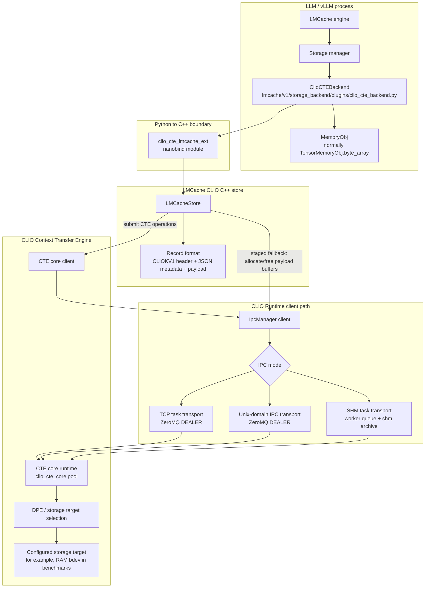
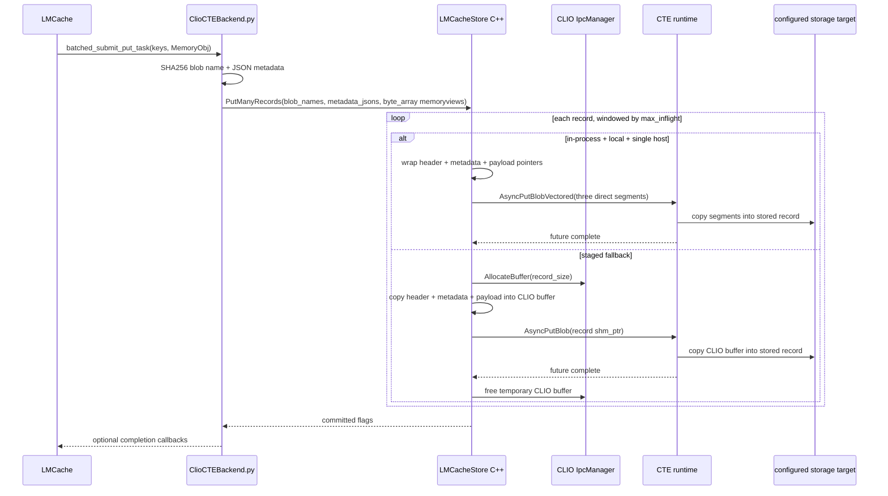
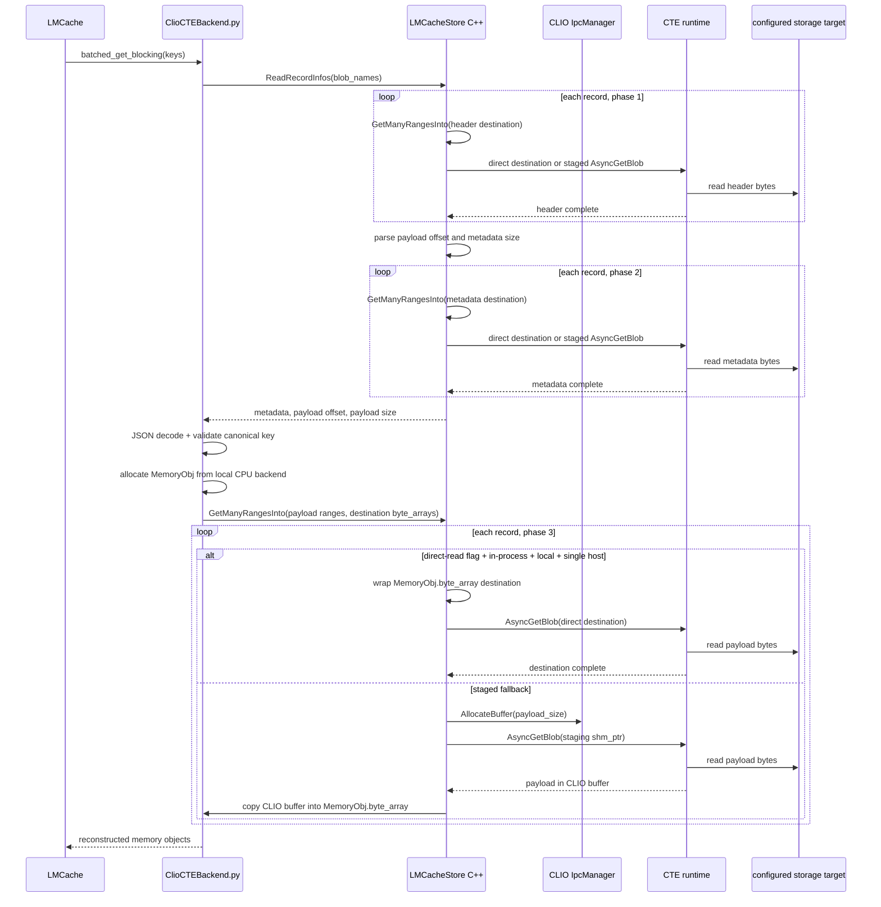
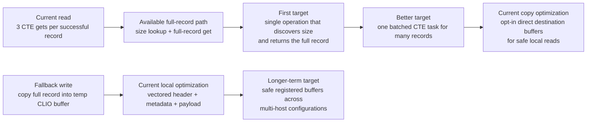

# LMCache CLIO CTE Integration

This document describes the local LMCache storage plugin backed by the CLIO
Context Transfer Engine (CTE), including the write, read, and lookup paths that
matter for benchmark performance.

The plugin source lives at
`context-transfer-engine/llm-hooks/lmcache/plugin/lmcache/v1/storage_backend/plugins/clio_cte_backend.py`.
The `plugin/` directory mirrors the LMCache package layout so that prepending it
to `PYTHONPATH` overlays the plugin into an installed `lmcache` package (e.g.
`PYTHONPATH=<repo>/context-transfer-engine/llm-hooks/lmcache/plugin:...`).

The plugin implements LMCache's generic `MemoryObj` storage interface. In the
normal worker configuration, the local CPU allocator returns
`TensorMemoryObj` instances whose writable payload view is `byte_array`.

CLIO supports three client-to-runtime transport modes. When no mode is forced,
the client probes for SHM first, then Unix-domain IPC, and finally falls back
to TCP. The selected mode changes task transport; it does not change the
direct-pointer eligibility rules described below.

## Configuration and Initialization

LMCache loads the backend by listing a plugin name in `storage_plugins` and
setting `storage_plugin.<name>.module_path` and
`storage_plugin.<name>.class_name` in `extra_config`. The plugin then uses
these additional entries from `extra_config`:

| Option | Default | Meaning |
| --- | --- | --- |
| `clio_cte.tag_name` | `lmcache_kv` | CTE tag used to hold LMCache records |
| `clio_cte.config_path` | empty | Optional CLIO client configuration path |
| `clio_cte.pool_query_mode` | `local` | CTE pool-query mode |
| `clio_cte.max_inflight` | `16` | Maximum CTE operations submitted before waiting |

Initialization creates an `LMCacheStore`, initializes the CTE client, and gets
or creates the configured tag. Worker read and write operations also require
LMCache's local CPU backend because it allocates destination memory objects.

Direct reads are controlled separately through the process environment:

| Environment variable | Default | Accepted true values | Meaning |
| --- | --- | --- | --- |
| `CLIO_LMCACHE_DIRECT_READ` | `false` | `1`, `true` (case-insensitive) | Allow CTE to read directly into caller buffers when the runtime, routing, and host-count safety checks pass |

The value is sampled when `LMCacheStore::Init` begins for an unopened store.
Calling `Init()` again on an already-ready store preserves the latched value.
Changing the environment while a store is open therefore has no effect.
`Close()` clears the value, so the next `Init()` samples the environment again.
Unset, empty, and all other values disable direct reads.

Both direct reads and direct writes additionally require an in-process CLIO
runtime, a local pool query, and a single-host runtime. The single-host
restriction prevents CTE from forwarding a process-local pointer to a remote
storage target. Calls that do not meet these conditions use shared-memory
staging. Direct reads are disabled by default; eligible direct writes are
enabled automatically.

## Write Path

Performance-sensitive write edges:

- The eligible direct path removes the full
  `MemoryObj.byte_array -> CLIO temporary buffer` copy. CTE still copies the
  three record segments into the configured storage target.
- The fallback path retains the temporary-buffer copy.
- Per-object CLIO task submission and completion.
- `max_inflight` controls how many put tasks are outstanding.
- The nanobind layer acquires read-only views of the Python payloads; it does
  not make another full payload copy.
- Direct futures wait without a timeout so Python cannot release or recycle a
  payload while CTE still holds its process-local pointer.

`batched_submit_put_task` is synchronous from the caller's perspective even
though C++ windows multiple asynchronous CTE futures internally. The async
plugin entry point currently uses `asyncio.to_thread` to run this blocking
implementation. Completion callbacks are supported for callback-aware callers,
but the normal LMCache `StorageManager` write path does not provide one.

## Read Path

Performance-sensitive read edges:

- Each successful, valid LMCache record currently causes three CTE reads:
  header, metadata, and payload. A miss or invalid record stops before all
  three phases complete.
- With `CLIO_LMCACHE_DIRECT_READ=1` and all safety checks satisfied, each range
  read targets its final caller-owned destination and does not allocate, copy,
  or free a temporary CLIO payload buffer.
- With the flag disabled or any safety check unsatisfied, the payload is copied
  from a CLIO temporary buffer into the LMCache destination `byte_array`.
- Direct futures wait without a timeout so LMCache cannot release or recycle a
  destination while CTE still holds its process-local pointer.

The nonblocking plugin entry point currently runs the blocking batch read with
`asyncio.to_thread`. It returns only the consecutive hit prefix, stopping at
the first miss, as required by LMCache's lookup semantics.

## Lookup and Removal

The backend canonicalizes each LMCache key, hashes it with SHA-256, and stores
it under `lmcache/v1/<hex digest>`. The canonical key is also retained in the
record metadata and validated during reads to guard against name mismatches.

`contains` uses CTE blob existence, while `batched_contains` uses a windowed
batch and returns the number of consecutive hits before the first miss. Pinning
is maintained by the Python plugin as an in-process reference count; it is not
a persistent CTE property. Removal delegates to CTE blob deletion and respects
the local pin count unless forced.

## Optimization Targets

Recommended first change:

Add a CTE operation, or a C++ helper backed by such an operation, that discovers
the record size and returns the complete record in one request. A helper built
only from the current APIs must first call `GetBlobSize` and then `GetBlob`, so
it reduces a successful read from roughly three CTE tasks to two, not one.
Reaching roughly `1 * num_ops` requires a known or cached record size, or a new
size-discovering read operation.

After reducing the per-record request count, a true batched CTE request for
many records would remove per-object task-submission overhead. The current
single-host direct-pointer paths already remove the large temporary-buffer copy
when their eligibility rules pass. Registered buffers with explicit lifetime
and remote-transport support are still needed to extend that optimization
safely beyond one host.
