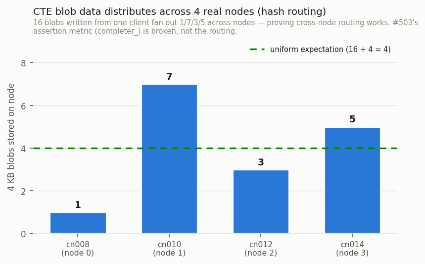
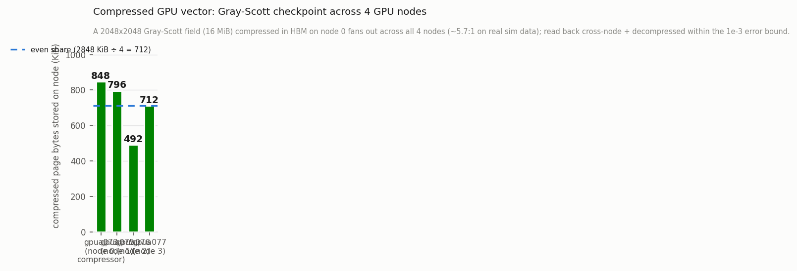

# Distributed CTE coherency on a real 4-node cluster (Delta)

Verifies memory **coherency** of the distributed CTE blob store across four
*physical* nodes for three workloads — **write-only**, **read-only**, and
**append-only** — and, as a by-product, settles the premise of issue #503.

> **This is a correctness test, not a performance benchmark.** Coherency is a
> binary property (data across nodes is either consistent or it is not), so there
> is no throughput/latency axis and **no with/without-our-system comparison** —
> "without a distributed blob store" leaves nothing to test. The performance
> with/without comparison lives in the GPU-compression work
> (`adapter/gpu_vector/benchmark/GS_PUTBLOB_COMPRESS_RESULTS.md`: 6.6× vs. the
> traditional checkpoint path). The one quantitative result here is *where data
> lands* (the figure below).

## Setup

- **4 physical nodes**, NCSA Delta `cpu-interactive`, one `clio_run` daemon per
  node (`srun --ntasks=4 --ntasks-per-node=1`).
- **Apptainer, not Docker.** Docker is unavailable on Delta; Apptainer uses host
  networking, so each daemon binds `0.0.0.0:<port>` and peers reach it at
  `<hostname>:<port>` — no bridge network needed.
- **Peer discovery:** hostfile generated from `$SLURM_JOB_NODELIST` (node id =
  line offset); identical port on every node (derived from the job id).
- **Storage:** CTE core pool `512.0`, four `file` bdev targets per node under
  node-local `/tmp`, `max_bw` DPE. Blobs hash-route by `(tag_id, blob_name)`
  (`core_runtime.cc:4795`) to a container that may live on any node.
- **Every rank is a client** (`CTE_CLIENT_MODE=all`) — the essential difference
  from the stock `test_core_functionality` distributed case, where only one node
  is a client. Coherency requires *different nodes touching the same blobs*.

Harness: [`run_slurm.sbatch`](run_slurm.sbatch) + [`node_launch.sh`](node_launch.sh);
tests: [`../../unit/test_cte_coherency.cc`](../../unit/test_cte_coherency.cc).

## Cluster formation (verified, not assumed)

Every daemon self-identified from the hostfile and peered — a real cluster, not
four isolated singletons (which would make any "coherency pass" vacuous):

```
cn008 → node=0    cn010 → node=1    cn012 → node=2    cn014 → node=3
Main server started on 0.0.0.0:9148 ; [PeerRecvThread] started   (all ranks)
```

## Coherency results — 12/12 pass (3 tests × 4 ranks)

| workload | what it proves | result |
|----------|----------------|:------:|
| **write-only** | 4 nodes write 8 disjoint blobs each concurrently; every rank then reads back **all 32** → no lost or cross-clobbered writes | ✅ 4/4 |
| **read-only** | rank 0 writes 16 blobs; all 4 nodes read the **same** blobs → identical content, no stale/torn reads on non-writer nodes | ✅ 4/4 |
| **append-only** | all 4 nodes write disjoint slices into **one shared blob** at increasing offsets; every rank verifies all slices → concurrent partial writes assemble, don't clobber | ✅ 4/4 |

**Byte accounting is exact.** Bytes written by the three workloads equal the sum
of allocated blocks across the four nodes:

| workload | bytes written |
|----------|---------------:|
| write-only (4 × 8 × 4 KB) | 131,072 |
| read-only (16 × 4 KB) | 65,536 |
| append-only (4 × 4 KB) | 16,384 |
| **total** | **212,992** |

Per-node allocated (`find -printf '%b'`): `16,384 + 69,632 + 53,248 + 73,728 =`
**212,992** — every byte accounted for, spread across all four nodes.

## Data distribution & the #503 finding



A separate single-client run wrote 16 × 4 KB blobs; measuring **allocated
blocks** per node shows them fanning out **1 / 7 / 3 / 5** (sums to 16) across the
four machines — normal variance for hashing 16 items into 4 buckets.

**So blob data genuinely distributes cross-node**, which contradicts #503's
stated premise ("every CTE blob op resolves to the client node's single local
container instead of fanning out"). The real problem is the **metric**, not the
routing:

- `completer_` is a `ContainerId`, not a `NodeId`. It is initialized to `0`
  meaning *unset* (`task.h:262`) and set via `SetCompleter(exec_container->
  container_id_)` inside `RouteLocal` (`ipc_manager.cc:3195`).
- With one `cte_core` container per node, that container's id is `0` on **every**
  node. Local execution → `completer_ = 0`; remote execution → the client's task
  copy is never set → `0`. Both read `0`, which is also "unset".
- Therefore `REQUIRE(put_avg_completer > 0.0)` tests an **impossible** condition
  regardless of routing. The disabled assertion should instead validate
  **resolved target-node distribution** (as the code's own comment guessed).

## Distributed compressed GPU vector (4 GPU nodes)

Beyond the plain blob store, we ran the **compressed GPU vector** distributed
across **4 physical A100 nodes**, checkpointing a **real Gray-Scott** field — HBM
compression on one GPU, compressed pages living across the cluster.



- **Node 0 evolves a 2048×2048 Gray-Scott** reaction-diffusion field (200 steps),
  then **compresses its 64 × 256 KiB pages IN HBM** (16 MiB logical, cuSZp, error
  bound 1e-3) and stores them through the compressor.
- The compressed pages **fan out across all 4 nodes** (allocated bytes
  848/796/492/712 KiB; **~5.7:1** overall). `4/4` nodes hold compressed pages.
- Each page is **read back cross-node, fetched to the GPU, and decompressed**;
  since Gray-Scott output is not analytic, the readback is verified against a
  **host copy of the pre-checkpoint field** — `max_abs_err = 1.0e-3`, exactly the
  error bound. **PASS**, reproduced on independent allocations.
- **The ratio is honest for real data.** A smooth synthetic field compresses
  ~13:1; the evolved Gray-Scott field gives ~5.7:1 here (in line with the
  single-node checkpoint's ~7.5:1). Using the real simulation is the point.

**This required a code change.** The compressor previously forwarded its
compressed pages to `cte_core` with `PoolQuery::Local()`, so every page piled up
on the GPU node — it never distributed. We added `ForwardQuery`
(`compressor_runtime.cc`): when `CLIO_CTE_COMPRESS_DISTRIBUTE=1`, the compressor
**hash-routes** its forward store/read by `(tag_id, blob_name)` — the same scheme
`cte_core` uses — so pages fan out and each read routes back to the node holding
that page. On one node `DirectHash` resolves local, so single-node behavior is
unchanged (the flag is opt-in).

**One design constraint worth recording:** the GPU node runs in **server mode**
(the test process *is* node 0 and hosts the compressor in-process). A raw device
pointer is not shareable to a separate daemon process without CUDA IPC handles,
so a client/daemon split segfaults when the daemon's compressor dereferences the
client's device address. Keeping the compressor in-process with the allocation
is what makes zero-copy HBM compression work in a distributed deployment.

Harness: [`run_slurm_gpu.sbatch`](run_slurm_gpu.sbatch) (`CTE_CLIENT_MODE=
server_rank0`); test:
[`../../../adapter/gpu_vector/test/test_gpu_vector_distributed_gpu.cc`](../../../adapter/gpu_vector/test/test_gpu_vector_distributed_gpu.cc).

### The real `Vector<T>` object over the distributed store

The two tests above drive the compressor's PutBlob/GetBlob path directly. To close
the loop, the actual **`Vector<T>` object** (async cache-manager writer → page
eviction → compress → distribute; then fault/read) was run over the 4-node
distributed `cte_core` by pointing `test_gpu_vector_compress` at this harness's
compose (`CLIO_GV_EXTERNAL_CONF=1`, `CTE_TEST_BIN=test_gpu_vector_compress`):

- **`FaultAllSync` read path: PASS** — the vector round-trips 262,144 elements
  within the error bound; pages distribute across the nodes. So the full vector
  lifecycle — not just the raw compressor path — works over a distributed store.
- **Transparent on-device fault: HANGS cross-node.** The on-device fault kernel
  spin-waits on the GPU while the compressor must now do a *network* GetBlob
  (fetch the compressed page from a remote node) and then decompress. The
  dedicated-CUDA-context fix handles the *local* decompress (and single-node
  on-device fault works — see the single-node suite), but a cross-node round-trip
  under a spin-waiting kernel does not resolve; the run times out. **Distributed
  reads must use the host-orchestrated path (`FaultAllSync` / the #700
  Transaction prefetch), not the on-device fault.** This is a real boundary of
  the transparent-fault model, not a bug in distribution.

### Single node, all 4 GPUs

The same test also runs **one Gray-Scott checkpoint per GPU, concurrently, on a
single 4×A100 node** ([`run_4gpu.sbatch`](run_4gpu.sbatch)) — so all four GPUs do
zero-copy HBM compression at once:

```
GPU 0: A100-SXM4-40GB pci=07:00.0   max_abs_err=1.0e-3  PASS
GPU 1: A100-SXM4-40GB pci=46:00.0   max_abs_err=1.0e-3  PASS
GPU 2: A100-SXM4-40GB pci=85:00.0   max_abs_err=1.0e-3  PASS
GPU 3: A100-SXM4-40GB pci=C7:00.0   max_abs_err=1.0e-3  PASS
```

Each process is pinned to a distinct physical GPU via `CUDA_VISIBLE_DEVICES` (the
four distinct PCI bus ids confirm all four were used). This is necessary because
the compressor's dedicated CUDA context is created on device 0
(`cuszp.h CompressorContext`); pinning makes each process's "device 0" a different
physical GPU, so all four compress on their own GPU with **no compressor change**.
A single process driving 4 GPUs would need per-device compressor contexts — a
follow-up if in-process multi-GPU is wanted.

## Measurement traps (documented so they don't recur)

1. **Sparse pre-allocation.** The file bdev pre-allocates each backing file to
   the target capacity as a *sparse* file, so apparent size
   (`du --apparent-size`, `find -printf '%s'`) reads identically on every node
   whether or not data landed there (a first run showed a meaningless "160 GiB on
   all 4 nodes"). Must count **allocated blocks** (`find -printf '%b'`, 512 B).
2. **False pass on zero tests.** A filter matching no cases makes the test binary
   exit `0`, which produced a green 4-node run with `Passed: 0`. The harness now
   treats "zero tests ran" as failure (`rc=2`).

## How to run

```bash
# Coherency suite (all ranks are clients):
sbatch --export=ALL,CTE_TEST_BIN=test_cte_coherency,CTE_CLIENT_MODE=all \
       run_slurm.sbatch ""

# The stock single-client distributed test (default mode/filter):
sbatch run_slurm.sbatch
```

## Gaps / follow-ups

- **docker-compose form** of this suite is not runnable on Delta (no Docker); the
  existing `test/integration/distributed` compose is the container equivalent.
- **Re-enable #503 assertions** against per-node target attribution rather than
  `completer_` (or expose a `NodeId` on the completed task).
- The coherency tests exercise the **CPU CTE blob store** (the distributed
  layer). The compressed **`gpu_vector`** is single-GPU, but its compressed pages
  now distribute across a multi-node `cte_core` (see the GPU section above) via
  the compressor's hash-routed forward — i.e. one GPU's compressed data spans the
  cluster's storage. A vector whose *pages* are sharded across *multiple GPUs*
  with cross-GPU coherency is the larger next step and does not exist yet.
